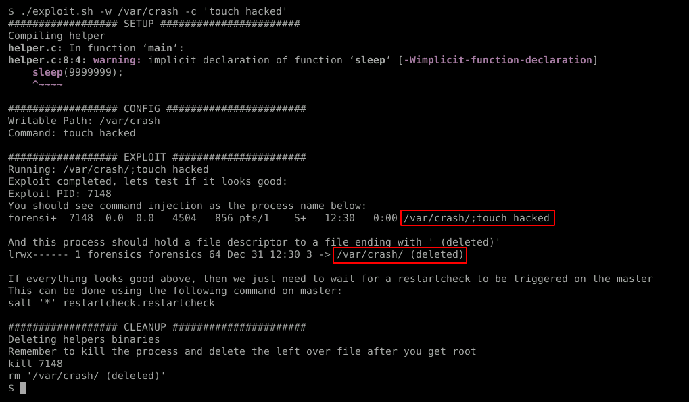

# CVE-2020-28243

A command injection vulnerability in SaltStack's Salt allows for privilege escalation via specially crafted process names on a minion when the master calls restartcheck. For a full writeup please see [this blog post](https://sec.stealthcopter.com/cve-2020-28243/)

**Affected Versions:** All versions between 2016.3.0rc2 and 3002.2

**Links:** [Mitre](https://cve.mitre.org/cgi-bin/cvename.cgi?name=2020-28243), [NVD](https://nvd.nist.gov/vuln/detail/CVE-2020-28243)

## Requirements

For this exploit to work the following are needed:

- SaltStack Minion between 2016.3.0rc2 and 3002.2
- Write/Exec access to a directory that isn't explicitly ignored by SaltStack
- Master needs to call `restartcheck.restartcheck` on this minion to trigger the exploit

## Usage

```
./exploit.sh -w PATH -c 'COMMAND'

  -w PATH       writable path (and not blocked by SaltStack)
  -c COMMAND    command to execute
```

### Screenshot



### Files

- exploit.sh - The exploit script to perform the privilege escalation.
- helper.c - Helper C program that will create the file handler for us, this could probably be replaced with a python or bash script. This file will be automatically generated by the exploit script. 

### Static Binaries
When gcc is not available to compile the helper binary on the target machine, you can compile it on your machine and copy the binary over. 

```
gcc helper.c -o ./helper -static
# Or for 32 bit: 
gcc helper.c -o ./helper -m32 -static  
```

Alternatively static binaries have been provided in this repo that you can use in the `static` folder.

